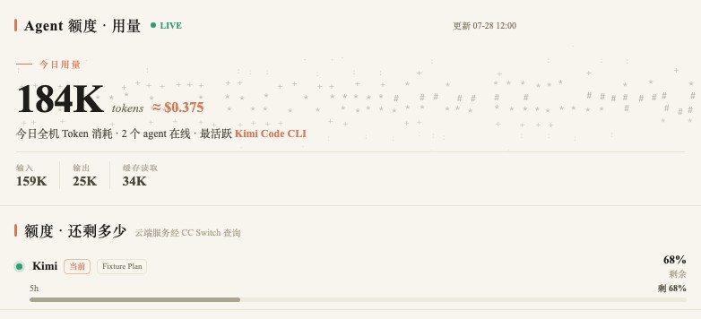
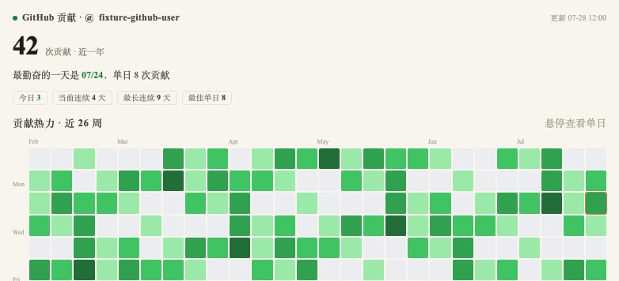
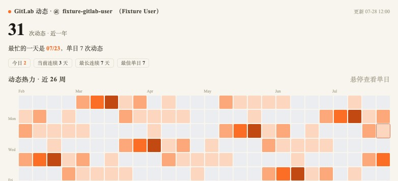

# mddd

本地优先的 macOS Dock 研发活动看板。

`mddd` 将本机 AI Agent 的 token 用量、成本估算和额度状态，与 GitHub、GitLab 仓库活动热力图集中到一个原生 macOS 应用中。应用负责依赖扫描、登录授权、凭证管理、定时刷新、缓存和故障恢复；Python Collector 负责采集，隔离的 Web Widget 负责保留现有数据可视化风格。

> **Development Preview**
>
> 当前版本可从源码构建和运行，最低支持 macOS 13。签名、公证、可下载的 `.app` 发布包和真实账号发布验收尚未完成。

## 核心能力

| 模块 | 能力 | 数据边界 |
|---|---|---|
| Agent 用量 | 汇总 Kimi Work、Kimi Code、Claude Code、Codex 和 Orca 会话的 token、成本、趋势及可用额度状态 | 以本机会话和用户授权的 Provider 为来源 |
| GitHub | 展示总贡献、今日贡献、连续贡献、最佳单日和 53 周贡献热力图 | 复用本机 `gh` CLI 登录态 |
| GitLab | 展示用户配置的私有实例活动和 53 周热力图 | HTTPS base URL + 存入 macOS Keychain 的 PAT |

应用还提供:

- 菜单栏常驻形态、弹出式模块面板和可配置的菜单栏指标 (1 至 3 项)。
- 首次启动 Onboarding、依赖扫描、登录配置和统一授权摘要。
- 默认每 30 分钟自动刷新，以及手动刷新、防重入、超时、退避和系统唤醒补采。
- 最后成功快照优先展示；单模块失败不会阻止其他模块更新。
- 设置页提供脱敏诊断预览和最小 ZIP 导出，不包含 Artifact 或账号活动数据。
- 支持键盘导航、VoiceOver 状态语义和 macOS 减少动态效果偏好。
- 经典书卷风主题，以及受系统版本支持时可选的 Liquid Glass 外观。

## 界面预览

预览使用仓库内的脱敏 fixture 数据。

| Agent 用量 | GitHub | GitLab |
|---|---|---|
|  |  |  |

## 快速开始

### 环境要求

- macOS 13 Ventura 或更高版本。
- Swift 6 工具链；当前验证版本为 Apple Swift 6.2.1。
- Python 3.9 或更高版本；Collector 仅依赖 Python 标准库。
- GitHub 模块需要已安装的 `gh` CLI。
- GitLab 模块需要可访问的 HTTPS 实例和用户提供的 PAT；私有实例可能还需要 VPN 或内部 CA。
- Agent 用量模块需要至少一个受支持的本机会话数据源。

只有 Apple Command Line Tools 时即可完成 SwiftPM 构建。签名、归档和公证需要完整 Xcode。

### 构建并运行

```bash
swift build --package-path macos/MdddApp
swift run --package-path macos/MdddApp MdddApp
```

首次运行后:

1. 在设置页扫描 Python、`gh` CLI、本机会话和可选 SQLite 数据源。
2. 选择需要启用的 Agent 用量、GitHub 和 GitLab 模块。
3. 按引导完成 GitHub 官方登录，或配置 GitLab HTTPS 地址与 PAT。
4. 阅读统一授权摘要并确认后，应用才会启动对应 Collector 和自动刷新。

真实账号访问和外部请求只应在个人 Mac 上、由用户明确授权后执行。

## 应用架构

```text
SwiftUI / AppKit Dock App
  ├─ Onboarding + Settings
  │    ├─ 本机只读依赖扫描
  │    ├─ GitHub 官方登录
  │    └─ GitLab 配置 + Keychain
  ├─ RefreshScheduler
  │    └─ CollectorRunner
  │         └─ Python Bridge (stdin/stdout JSON)
  │              ├─ Agent Usage Collector
  │              ├─ GitHub Collector
  │              └─ GitLab Collector
  └─ ArtifactStore
       └─ 隔离 WKWebView
            └─ Agent / GitHub / GitLab Widgets
```

可测试业务逻辑位于 `MdddAppCore` library target；`MdddApp` executable target 只保留应用入口、SwiftUI/AppKit 界面装配和 Widget 资源。所有 Swift Harness 直接依赖 Core target。

运行链路:

1. 原生层根据 Onboarding 结果和用户授权决定允许启动的模块。
2. Scheduler 为每个模块创建受控运行任务，并通过 Bridge 的 stdin 传入最小 context 和 credentials。
3. Collector 返回 `{"artifact": ...}`；Bridge 验证 schema、错误语义和凭证更新。
4. ArtifactStore 原子保存最后成功快照。
5. WidgetHost 将验证后的 Artifact 映射为 `DaimonWidget.data.main`，由现有 Widget 渲染。

Collector 仍保留独立 CLI 入口，用于开发、测试和故障排查，但不再是产品的主要使用方式。

## 安全与隐私

- 本地优先，无项目自有服务端，也不默认同步活动数据。
- GitLab PAT 保存在 macOS Keychain；GitHub 凭证继续由 `gh` 管理。
- 凭证通过 Bridge stdin 的单次请求传递，不进入命令行参数、Artifact 或日志。
- App 模式下 Python 不直接写 Keychain，也不写回第三方认证文件。
- Widget 使用非持久化、受 CSP 限制的 WKWebView，不访问 Keychain、文件系统、进程通道或第三方 API。
- 配置和快照写入用户级 Application Support；真实凭证、账号活动和 `data/*.json` 不得进入仓库。
- 诊断包采用白名单字段，生成后会解压复核文件清单并再次扫描敏感形态。
- 菜单栏指标仅显示通用状态和聚合数字, 不显示账号、仓库或 token 明细。

## 项目结构

```text
mddd/
├── macos/MdddApp/          # SwiftUI/AppKit 菜单栏应用、Scheduler、缓存和 WidgetHost
│   ├── Sources/MdddApp/
│   ├── Sources/MdddAppCore/
│   ├── Sources/MdddOnboardingCore/
│   └── Tests/
├── bridge/                 # Swift 与 Python 之间的版本化 JSON 协议和安全校验
├── agent-usage/            # Agent 用量 Collector 与 Widget
├── github/                 # GitHub Collector 与 Widget
├── gitlab/                 # GitLab Collector 与 Widget
├── tests/                  # Python 契约、Collector、Widget 和视觉 fixture 测试
└── docs/                   # OpenSpec、工具链和授权设计文档
```

关键入口:

- macOS App: `macos/MdddApp/Sources/MdddApp/MdddApp.swift`
- Python Bridge: `bridge/run_bridge.py`
- Collectors: `*/collector/*.py`
- Widget 源文件: `*/widget/index.html`
- Artifact schemas: `bridge/schemas/`

## 数据位置、清理与回滚

应用自有数据位于:

- `~/Library/Application Support/mddd/config/onboarding-v1.json`: 非敏感配置和授权版本。
- `~/Library/Application Support/mddd/snapshots/`: 当前和 previous Artifact 快照。
- `~/Library/Application Support/mddd/metadata/modules.json`: 最近成功、尝试时间和错误分类。
- macOS Keychain service `com.mddd.dashboard.credentials`: 应用持有的 GitLab PAT。

清理前先退出应用。在设置页使用“断开”删除单个 GitLab 凭证，或使用“撤销全部授权”停止全部调度；需要完全重置时，再通过 Finder 删除 `~/Library/Application Support/mddd/`，并在“钥匙串访问”中删除上述 service 的项目。删除快照和 Keychain 项不可由应用自动恢复，操作前应确认不再需要最后成功数据和现有授权。

出现回归时可先撤销受影响模块并继续使用其他模块；回退到兼容 Bridge v1 / Artifact v1 的旧构建不会改写第三方数据库。若新快照损坏，应用优先回退 previous；不要通过修改 CC Switch 或 Antigravity 数据库来修复 mddd。

## 故障排查

- 设置页“重新检查”用于复核 Python、`gh`、会话位置和只读 SQLite 状态。
- GitHub 无法连接时先在终端执行 `gh auth status`；登录仍由 `gh auth login --web` 官方流程完成。
- GitLab 无法连接时检查 HTTPS base URL、VPN/内部 CA、PAT 是否过期以及最小读取权限。
- 有旧快照时，刷新失败不会清空主视图；状态文案会区分过期、离线、授权失效和部分成功。
- 导出支持信息前先使用设置页“预览诊断”，确认其中只有状态和校验元数据。

## 开发与验证

默认离线验证入口:

```bash
./scripts/verify-local.sh
```

该脚本检查 Python 语法，运行全部 Python/Bridge/schema/Widget 测试，构建 Swift 包，并执行 Onboarding、缓存、Runner、调度、生命周期、诊断和隔离集成 Harness。隔离集成只在随机临时 HOME 中运行 Agent Collector，关闭外部额度能力，不访问真实账号、Keychain 或第三方数据库。

Python 语法和测试:

```bash
python3 -m py_compile \
  agent-usage/collector/collect_usage.py \
  github/collector/collect_github.py \
  gitlab/collector/collect_gitlab.py \
  bridge/*.py

python3 -m pytest -q
```

Swift 构建和单个 Core Harness:

```bash
swift build --package-path macos/MdddApp
swift run --package-path macos/MdddApp MdddOnboardingCoreHarness
swift run --package-path macos/MdddApp RefreshSchedulerHarness "$PWD"
```

Widget JavaScript 语法、安全隔离和 Bundle 副本一致性由 Python 测试覆盖。真实 Collector、OAuth、PAT、签名和 `.app` 发布验证不属于默认测试流程，需要单独授权和对应环境。

更多资料:

- [工具链基线](docs/development/toolchain.md)
- [Provider 授权矩阵](docs/development/provider-auth-matrix.md)
- [发布人工验收清单](docs/development/release-acceptance.md)
- [产品化设计](docs/openspec/changes/productize-macos-dock-dashboard/design.md)
- [实现任务状态](docs/openspec/changes/productize-macos-dock-dashboard/tasks.md)

## 当前限制

- 尚未提供签名、公证和可下载的 `.app` 发布包。
- 完整 Xcode 下的 archive、entitlement、Keychain 和 Dock 生命周期发布验证尚未完成。
- 真实 GitHub、GitLab 和 Agent Provider 登录验收需要用户在个人 Mac 上明确授权。
- 30 分钟自动刷新、系统睡眠补偿、凭证续期和撤销仍需真实环境验收。
- VoiceOver、增加对比度和全键盘流程仍需在签名发布构建上完成人工验收。

## License

[MIT](LICENSE)
