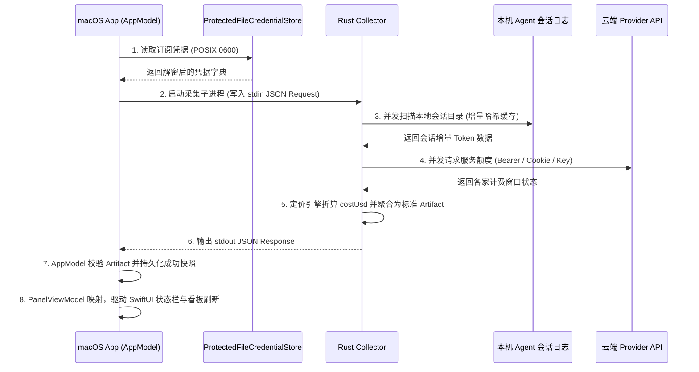

# 00-系统总体设计

<!-- @topic: SystemOverview -->
> **文档ID**: DESIGN-SYS ｜ **状态**: 现行基线
> **最后更新**: 2026-09-23 ｜ **对应 Topic**: `SystemOverview`

---

## 1. 简介 (Introduction)

`Bruce` 是一款运行在 macOS 菜单栏环境中的本地优先（Local-First）AI Agent 研发用量与订阅额度看板。

- **核心动因**：随着开发者在本机同时运行多个 AI 编程与研究 Agent（Claude Code, Codex, Kimi Code, OpenCode 等），Token 消耗速度极快、各家云端额度计费窗口各异（5小时滑动、自然周、月度等），传统开发者必须频繁切换网页查询账单或面临突发断配。
- **系统定位**：作为轻量级常驻系统的系统托盘指示器与下拉控制台，向下通过高性能 Rust 引擎安全扫描本机 Agent 运行痕迹与出站查询配额，向上以原生 SwiftUI 提供高保真、沉浸式状态监控。

---

## 2. 目标与非目标 (Goals & Non-Goals)

### 2.1 目标 (Goals)
1. **多端应用与引擎解耦**：采用现代 Monorepo 分层架构（`apps/` + `core/`），数据采集核心与 UI 交互层完全隔离，天然支持向 Windows/Linux 跨平台扩展；
2. **纯本地安全闭环**：无自有云端服务端，用户所有 Token 账单、凭证密钥与会话元数据 100% 闭环在用户本机；
3. **精准用量与成本感知**：内建 26 款主流大模型基准计费引擎，提供精确到模型级与 Agent 级的费用核算与小时级趋势；
4. **零干扰交互体验**：脱离 Ad-hoc 签名导致的频繁系统钥匙串密码弹窗，外部 CLI 探测静默回退，菜单栏自适应浅色/深色桌面壁纸。

### 2.2 非目标 (Non-Goals)
1. **不充当 AI 网关或代理**：本项目不代理任何实际的大模型对话流量，仅旁路只读分析会话日志；
2. **不执行写操作或修改外部会话**：读取外部应用 SQLite 数据库（如 CC Switch 等）严格限定 `mode=ro`，绝不修改、迁移或修复外部数据库；
3. **不做云端数据同步**：不建设远程中心化用户系统，所有订阅配置统一保存在本地受保护存储中。

---

## 3. 全局架构与领域模型 (Architecture & Domain Models)

### 3.1 总体逻辑分层架构

```text
┌────────────────────────────────────────────────────────────────────────┐
│                       应用呈现层 (apps/)                                │
│  ┌───────────────────────────────────┐  ┌───────────────────────────┐  │
│  │    macOS 原生常驻应用 (apps/macos) │  │  Web 小组件 (apps/widget) │  │
│  │   SwiftUI / MenuBar / Glass Panel │  │  Daimon / Blueprint 卡片  │  │
│  └─────────────────┬─────────────────┘  └─────────────┬─────────────┘  │
└────────────────────┼──────────────────────────────────┼────────────────┘
                     │ (调用与解析)                      │ (映射 data.main)
                     ▼                                  ▼
┌────────────────────────────────────────────────────────────────────────┐
│              IPC 通信契约规范 (core/collector/schemas/)                 │
│              request-v1.json / response-v1.json / agent-usage-v1.json  │
└────────────────────────────────────┬───────────────────────────────────┘
                                     │ (JSON over stdio)
┌────────────────────────────────────┼───────────────────────────────────┐
│                       核心引擎层 (core/)                                │
│  ┌─────────────────────────────────┴─────────────────────────────────┐  │
│  │                  Rust Core Collector (core/collector)             │  │
│  │  - collector-application: 调度执行、上下文装配与多模型聚合          │  │
│  │  - collector-local: 本机会话扫描、目录防环保护与 SQLite 只读适配     │  │
│  │  - collector-provider: 云端 8 大 Provider 额度出站查询与 OAuth 轮换 │  │
│  │  - collector-domain: 领域模型、26 款基准定价表与成本核算引擎        │  │
│  │  - collector-bridge: 跨进程 IPC 协议编解码与 Schema 版本校验        │  │
│  └───────────────────────────────────────────────────────────────────┘  │
└────────────────────────────────────────────────────────────────────────┘
```

### 3.2 数据流转管线



---

## 4. 功能模块矩阵与 Topic 映射

系统核心业务按主题（`@topic`）实施中枢解耦，所有任务卡与变更卡均锚定对应主题：

| 模块序号 | 设计方案文档 | 核心 Topic | 领域职责 | 关键实现目录 |
|---|---|---|---|---|
| **01** | [01-数据采集与多模型计费引擎.md](01-数据采集与多模型计费引擎.md) | `TokenUsage` | 8 大 Agent 会话扫描、增量缓存、26 款模型定价与 Token 费用核算 | `core/collector/crates/` |
| **02** | [02-订阅额度与凭据安全存储.md](02-订阅额度与凭据安全存储.md) | `SubscriptionQuota` | 8 大 Provider 额度适配、POSIX 0600 凭据存储、原子落盘与防扰 | `apps/macos/Sources/BruceOnboardingCore/` |
| **03** | [03-菜单栏状态与多风格原生渲染.md](03-菜单栏状态与多风格原生渲染.md) | `MenuBarIndicator` | 赛博精密环形仪表、纯图标模式、液态玻璃与 Nothing 风格点阵控制台 | `apps/macos/Sources/BruceApp/Views/` |
| **04** | [04-设置中心与价格校准交互.md](04-设置中心与价格校准交互.md) | `PricingEngine` | 菜单栏实时预览条、卡片排序拖拽、全模型价格表与自定义覆盖校准 | `apps/macos/Sources/BruceApp/Settings/` |

---

## 5. 调度、容灾与快照持久化机制

1. **自动刷新节拍**：
   - 默认调度周期为 **30 分钟**；
   - 支持防重入门禁（若上次采集正在执行，自动跳过新一轮调度）；
   - 支持系统休眠唤醒感知（Wake-up Catch-up）：系统唤醒后若距离上次刷新超过设定周期，立即启动补偿采集。
2. **三级快照容灾**：
   - **内存态 (`AppModel.snapshot`)**：响应 UI 即时渲染；
   - **当前持久化快照 (`snapshots/current.json`)**：最近一次成功采集的完整快照，下次冷启动秒开呈现；
   - **灾备回退快照 (`snapshots/previous.json`)**：若当前快照文件在系统异常断电中出现解析损坏，自动无感回退至前一次健康快照，杜绝界面出现空数据白屏。

---

## 6. 变更与演进记录

| 变更编号 | 关联版本 | 核心演进要点 |
|---|---|---|
| `C001` | `0.9.0+` | 重构项目工程目录为 Monorepo `apps/` 与 `core/` 分层架构，清理 4.4GB 缓存与幽灵目录 |
| `C002` | `0.9.0+` | 隔离历史文档与旧设计目录至 `_adflow_backup/original_docs/`，纯化现行设计基线与资源索引 |
