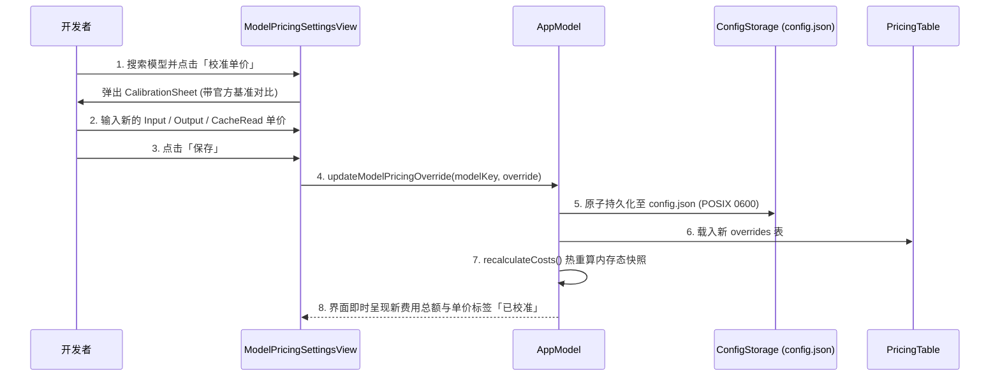

# 设置中心与价格校准交互设计方案

<!-- @topic: PricingEngine -->
> **文档ID**: DESIGN-SETTINGS ｜ **状态**: 现行基线
> **最后更新**: 2026-09-23 ｜ **所属总体**: [00-系统总体设计.md](00-系统总体设计.md) ｜ **对应 Topic**: `PricingEngine`
> 📌 **变更总账**: 参见 [变更总账 (PricingEngine)](../change/index.json#PricingEngine)

---

## 1. 简介 (Introduction)

本方案定义 `Bruce` 的原生设置中心（Settings Window）及大模型单价自定义校准（Model Pricing Overrides）交互系统。

- **业务动因**：随着大模型市场竞争与厂商定价动态调整（例如夜间折扣、企业级专有折扣、自定义代理中转折扣），默认静态基准单价可能与用户的真实采购账单存在偏差。此外，用户需要精细控制菜单栏展示风格、调度节拍、卡片显隐顺序，并安全录入 Provider 凭据。
- **系统定位**：位于 `apps/macos/Sources/BruceApp/Settings/`，提供多 Tab 分区卡片式设置面板与模型单价校准工作台，直接操作 `config.json`、`credentials.json` 并实时反哺 `AppModel` 费用重算。

---

## 2. 目标与非目标 (Goals & Non-Goals)

### 2.1 目标 (Goals)
1. **模块化卡片式布局 (Cardification)**：6 个功能分区全部采用独立圆角卡片（`SettingsCard`），配备专属彩色色标，无论切换经典或液态玻璃主题均保持视觉一致性；
2. **多模型定价与校准工作台**：
   - 完整罗列 26 款官方基准模型定价（Input / Output / Cache Read 单价）；
   - 支持多维筛选（全部 / 已有用量 / 已人工校准）；
   - 交互式弹窗修改单价，支持一键重置单模型或重置全量；
   - 单价变更后即刻触发内存态用量与历史费用动态重算（Hot Recalculation），无需重新触发全盘 I/O 扫描；
3. **菜单栏动态实时预览**：设置面板顶部内嵌高保真模拟菜单栏，滑块或选项变动即时反馈真实尺寸与视觉效果；
4. **凭据与账号管理工作台**：针对 8 大 Provider 提供连接测试、分账号管理、一键从本机 CLI 发现导入。

### 2.2 非目标 (Non-Goals)
1. **不提供在线价格爬虫**：模型价格以本地官方基准表及用户自定义为准，不发起外部未经许可的网络价格嗅探；
2. **不接管系统系统偏好设置**：开机自启动严格使用 macOS 标准 `SMAppService` API，不安装隐式 LaunchDaemons。

---

## 3. 需求分析 (Requirements)

### 3.1 功能需求清单
- **FR-1 分区卡片体系**：
  - **通用 (General)**：开机启动切换、自动刷新频率（15m / 30m / 60m）、版本号显示（读取自 `VERSION`）；
  - **菜单栏定制 (MenuBar)**：实时预览条、显示模式（纯图标 / 数值 / 组合）、刘海屏折叠阈值；
  - **模型单价与计费 (Pricing)**：多模型价格表、搜索栏、状态过滤、校准弹窗、重置确认；
  - **订阅额度 (Subscription)**：8 大 Provider 状态指示、API Key 输入、连通性测试；
  - **卡片管理 (Cards)**：卡片显隐开关与拖拽重排（Drag-and-Drop）；
  - **数据与诊断 (Diagnostics)**：缓存清理、导出完整诊断 JSON。
- **FR-2 单价即时热重算**：当保存模型覆盖项后，`AppModel` 遍历已解码的 `AgentUsageArtifact`，重新执行纯函数换算并广播 `@Published` 变更，驱动面板刷新。

### 3.2 非功能需求 (NFR)
- **界面响应**：过滤筛选和搜索需在 16ms 内无卡顿完成（内存纯数组过滤）；
- **配置落盘**：用户偏好保存到 `~/Library/Application Support/Bruce/config.json`，采用 POSIX 0600 安全权限与原子替换。

---

## 4. 功能设计 (Functional Design)

### 4.1 模型价格校准交互流程



---

## 5. 详细设计 (Detailed Technical Design)

### 5.1 核心业务规则 (Core Rules)
<!-- @topic: PricingEngine -->

#### 变更演进索引
| 变更编号 | 类型 | 简介 | 规则演进 |
|---|---|---|---|
| `C001` | 重构 | Monorepo 目录分层与设置组件收拢 | 设置组件收拢至 `apps/macos/Sources/BruceApp/Settings/` |

#### 现行设计规则

##### 1. 设置分区卡片容器规范 (`SettingsCard`)
设置页 6 个分区全部包裹在 `SettingsCard` 中，不跟随桌面主题变动：
```swift
struct SettingsCard<Content: View>: View {
    let title: String
    let accentColor: Color
    @ViewBuilder let content: Content

    var body: some View {
        VStack(alignment: .leading, spacing: 12) {
            HStack(spacing: 8) {
                RoundedRectangle(cornerRadius: 2)
                    .fill(accentColor)
                    .frame(width: 4, height: 16)
                Text(title)
                    .font(.headline)
                    .fontWeight(.bold)
            }
            content
        }
        .padding(16)
        .background(Color(nsColor: .controlBackgroundColor))
        .clipShape(RoundedRectangle(cornerRadius: 12))
        .overlay(
            RoundedRectangle(cornerRadius: 12)
                .strokeBorder(Color.primary.opacity(0.08), lineWidth: 1)
        )
        .shadow(color: Color.black.opacity(0.04), radius: 4, x: 0, y: 2)
    }
}
```

##### 2. 分区色标规范
| 分区名称 | 色标代码 | 色彩语义 |
|---|---|---|
| 通用 (General) | `#0A84FF` | 系统蓝 |
| 菜单栏 (MenuBar) | `#30D158` | 状态绿 |
| 订阅额度 (Subscription) | `#FF9F0A` | 警示橙 |
| 模型计费 (Pricing) | `#BF5AF2` | 算力紫 |
| 卡片排序 (Cards) | `#8E8E93` | 中性灰 |
| 数据与诊断 (Diagnostics) | `#40C8E0` | 极客青 |

##### 3. 单价覆盖契约 (`ModelPricingOverride`)
落盘于 `config.json` 中的 `pricingOverrides` 字典：
```json
{
  "pricingOverrides": {
    "claude-3-7-sonnet": {
      "inputPricePerMillion": 2.50,
      "outputPricePerMillion": 12.00,
      "cacheReadPricePerMillion": 0.25,
      "note": "企业级 8 折通道"
    }
  }
}
```
- 若字段为 `null`，自动回退到内置基准单价；
- 提供「恢复默认」按钮，点击后从字典物理移除该模型键并重算。

---

## 6. 扩展设计 (Additional Technical Design)

### 6.1 实时预览条 (Live MenuBar Preview)
- 设置面板中内嵌 1:1 尺寸的模拟菜单栏控件；
- 实时响应用户在设置中对「是否显示美元开销」、「是否显示 Token 缩写」、「进度环色彩」等切换，消除用户在设置与实际菜单栏之间的认知差。

### 6.2 诊断与导出 (Diagnostics Export)
- 诊断模块负责聚合：操作系统版本、Bruce 版本、各 Agent 目录探测状态、Rust Collector 退出状态与内存快照；
- 一键导出 `bruce-diagnostics-<timestamp>.json`，自动对敏感凭据执行脱敏剔除。

---

## 7. 参考资料 (References)

- `_adflow_backup/original_docs/development/11-settings-cardification-design.md`：卡片化设置历史规范（已隔离归档）
- `apps/macos/Sources/BruceApp/Settings/ModelPricingSettingsView.swift`：价格校准交互面板
- `core/collector/crates/collector-domain/src/pricing.rs`：Rust 端单价解析与覆盖合并
