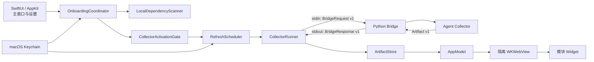

# mddd 设计文档

| 项目 | 定义 |
|---|---|
| 文档版本 | 1.0 |
| 适用平台 | macOS 13 及以上 |
| 产品形态 | 原生 macOS Dock 应用 |
| 技术基线 | Swift 6, SwiftUI, AppKit, WebKit, Python 3.9+ |

## 1. 文档目的

本文档定义 `mddd` 的完整产品需求、交互体验、UI 规范、系统架构、数据契约、安全边界和验收标准。设计以仓库内的 macOS 应用、Onboarding Core、Python Collector、Bridge、Artifact Store、Widget 和测试代码为依据。

## 2. 产品定义

### 2.1 产品定位

`mddd` 是一个本地优先的 macOS Dock 研发活动看板。它把分散在本机 AI Agent 会话和本地工具数据库中的研发活动汇总到一个原生应用中, 为开发者提供:

- AI Agent token 使用量、成本估算和趋势分析。
- 本机依赖扫描、登录配置、最小授权和凭证管理。
- 自动刷新、最后成功快照、故障隔离和 Dock 状态提醒。
- 保留现有 Widget 视觉风格的统一原生容器。

应用不依赖项目自有服务端, 不默认上传本机活动记录, 不要求用户把真实凭证写入项目文件。

### 2.2 目标用户

- 同时使用多个 AI 编程 Agent 的 macOS 开发者。
- 需要快速理解每日 token 消耗、模型使用分布和成本的个人用户。
- 希望在一个低打扰 Dock 应用中查看研发节奏的用户。

### 2.3 核心目标

1. 用户打开应用后能够快速判断今日 Agent 消耗、主要消耗来源和近期趋势。
2. 任何 Collector 运行前都必须经过依赖检查、模块选择、当前授权版本和运行态 Gate。
3. 凭证、会话内容和外部应用数据库必须保持最小读取、最小传递和最小持久化。
4. 单模块失败不得阻断其他模块, 失败时优先保留最后一次有效展示。
5. 经典视觉和既有 Widget 布局必须保留; 新主题只改变材质和语义色, 不改变信息结构。

### 2.4 产品边界

`mddd` 负责聚合与展示个人研发活动, 不承担以下职责:

- 不作为聊天客户端、Agent 执行器或代码编辑器。
- 不修改 Agent 会话、CC Switch 或 Antigravity 的业务数据。
- 不在 Widget 中直接访问网络、Keychain、本机文件或原生进程。
- 不把本地快照视为团队统计、财务结算或平台账单的权威来源。

## 3. 产品原则

### 3.1 本地优先

会话扫描、聚合、缓存和渲染均在本机完成。外部请求只用于明确授权的 Provider 能力。

### 3.2 默认拒绝

模块未选择、授权版本无效、依赖不满足、连接未验证或应用正在退出时, Collector 均不得启动。

### 3.3 最小授权

每次运行只向 Collector 传入该模块需要的 capability、context 和 credentials。缺失 capability 按拒绝处理, 不允许 Collector 自行扩大权限。

### 3.4 最后成功数据优先

刷新、网络或认证故障不清空已有看板。UI 保留最后一次通过校验的 Artifact, 同时用文字和图标说明数据状态。

### 3.5 模块隔离

Agent 用量具有独立的就绪度、刷新状态、缓存和失败恢复。故障不得影响其他模块。

### 3.6 视觉连续性

应用使用原生导航和设置页承载产品流程, 数据展示继续使用现有 Widget。经典主题采用米白书卷底、暖灰文字和低饱和边框; Agent 使用陶土橙。

## 4. 信息架构

### 4.1 主导航

应用使用 `NavigationSplitView` 构建左右结构:

```text
┌──────────────────────┬────────────────────────────────────────────┐
│ mddd                 │ 模块标题                         状态胶囊   │
│                      │                                            │
│ Agent 用量  最新     │              WidgetHost                    │
│ 设置                 │                                            │
│                      │                                            │
└──────────────────────┴────────────────────────────────────────────┘
```

侧栏固定包含:

1. Agent 用量。
2. 设置。

每个数据模块在标题下显示简短状态。设置模块不显示采集状态。

### 4.2 窗口与 Dock 行为

- 默认窗口尺寸为 `980 × 680 pt`。
- 最小窗口尺寸为 `760 × 540 pt`。
- 侧栏最小宽度为 `180 pt`, 理想宽度为 `210 pt`。
- 应用只维护一个主窗口, 稳定窗口标识为 `mddd.main-window`。
- 用户关闭窗口后再次点击 Dock 图标, 应恢复、取消最小化并激活原主窗口, 不创建重复窗口。
- 应用退出时先停止调度和接受新任务, 再取消运行中的任务; 宽限 2 秒后仍未退出的子进程强制终止。

### 4.3 Dock Badge

Dock Badge 只表达通用严重程度, 不包含账号、仓库、host、token 或活动数量:

| Badge | 含义 |
|---|---|
| 无 | 所有模块处于正常、可运行或刷新中状态 |
| `•` | 至少一个模块部分可用、数据过期、需要授权或网络不可用 |
| `!` | 至少一个模块刷新失败且没有更高层的可恢复展示语义 |

## 5. 核心用户流程

### 5.1 首次启动

1. 应用创建单一主窗口并启动 Scheduler。
2. Scheduler 尝试载入各模块最后成功快照。
3. Onboarding 执行本机只读扫描, 检查 Python、Agent 会话目录和可选 SQLite schema。
4. 应用展示各模块的依赖、连接和阻塞原因。
5. 用户选择需要启用的模块。
6. 应用展示统一授权摘要。
7. 用户确认当前授权版本后, Activation Gate 逐模块计算是否允许调度。
8. 允许的模块立即执行首轮采集, 后续按默认周期自动刷新。

本机扫描本身不产生外部请求。未确认授权时, 应用只能使用已持久化的非敏感连接状态, 不得自动复核外部连接。

### 5.2 日常打开

1. 优先展示本地最后成功快照。
2. 快照在 1 小时内视为可用新鲜数据, 超过 1 小时显示过期状态。
3. 已授权且满足依赖的模块按上次成功时间计算下次刷新。
4. 没有成功快照的模块在启用后立即采集。
5. 系统唤醒或应用重新激活时, 对超过刷新周期的模块补采一次。

### 5.3 授权撤销

- “撤销全部授权”清除当前 consent version, 并停止所有模块调度。
- 撤销全部授权保留模块选择, 便于用户重新审阅授权后恢复。
- 授权版本升级后, 旧授权自动失效, 用户必须重新确认。

## 6. 功能设计

### 6.1 Agent 用量模块

#### 6.1.1 数据源

Agent Collector 以只读方式识别和聚合以下本机会话源:

- Kimi Work。
- Kimi Code CLI。
- Claude Code。
- Codex CLI。
- Orca 托管的 Codex 会话和分账号会话目录。

CC Switch 的 `model_pricing` 用于本地成本估算。CC Switch 和 Antigravity SQLite 仅按真实查询契约探测 schema, 均使用只读模式打开, 不执行 DDL、迁移或修复。

Onboarding 把 Kimi Work、Kimi Code CLI、Claude Code 和 Codex CLI 作为主要会话源进行就绪判断。Orca 会话由 Collector 作为补充来源单独聚合, 但不单独解除“没有可用主要会话源”的运行阻塞。

#### 6.1.2 聚合维度

每个 Agent 形成独立条目, 包含:

- Agent ID、展示名、状态和非敏感说明。
- 今日 input、output、cache read、cache creation 和 total token。
- 最近 14 日按天的 input、output 和 total。
- 当日 24 小时 token 分布。
- 按模型的 token 分布。
- 当日按模型的详细用量。
- 按项目的 token 分布。
- 根据本地定价表估算的当日美元成本。

全局汇总包含:

- 今日全机 token 总量。
- input、output 和 cache read 拆分。
- 有效 Agent 数量。
- 当日总成本。
- 最近 14 日按 Agent 堆叠趋势。

定价缺失时成本显示未知, 不把未知价格当作零成本。所有 token 和成本字段不得为负数。

#### 6.1.3 Provider 额度

Agent Artifact 保留 `services` 额度展示契约, 可表达额度窗口、余额、套餐、重置时间和查询状态。

应用默认只授予:

- `localSessions`: 读取本机会话。
- `localPricing`: 读取本地定价。

应用默认不授予 `externalQuotas`, 因此不得读取 Provider OAuth 文件、不得读取 CC Switch 中的云端认证内容、不得发送云端额度请求。Widget 必须把这种情况展示为“未授权/未启用”, 不得伪装为空额度或查询成功。

任何额度扩展都必须继续遵守 capability 显式授权、Provider 级凭证路由和 credential update 白名单。

### 6.2 自动刷新

默认调度参数:

| 参数 | 值 |
|---|---:|
| 自动刷新周期 | 30 分钟 |
| 数据过期阈值 | 60 分钟 |
| 同时运行模块上限 | 2 |
| 单模块运行超时 | 90 秒 |
| 子进程取消宽限 | 2 秒 |
| 基础退避 | 30 秒 |
| 最大退避 | 30 分钟 |
| Rate Limit 退避 | 5 分钟 |
| 最大连续退避重试 | 5 次 |

调度规则:

- 单模块同一时间只能有一个运行实例。
- 模块运行中收到新的刷新触发时, 合并为一次 pending rerun。
- 全局达到 2 个运行模块时, 其他刷新请求进入等待状态。
- 成功后从 `lastSuccessAt` 计算下一次刷新。
- Rate Limit 使用固定 5 分钟退避。
- 其他可重试错误采用指数退避和最多 10% jitter, 但不超过 30 分钟。
- 认证错误进入 `authRequired`, 自动刷新暂停, 等待用户重新登录。
- 达到重试上限后等待下一个正常刷新周期。
- 系统唤醒和应用重新激活只对过期模块补采, 不对 `authRequired` 模块自动重试。

### 6.3 缓存与恢复

每个模块维护:

- 当前有效快照。
- 上一个有效快照。
- 最后成功时间。
- 最后尝试时间。
- 数据是否过期。
- 最后错误分类。

发布流程必须为:

1. 内存中验证 Artifact。
2. 将现有有效 current 复制为 previous。
3. 写入权限为 `0600` 的临时文件。
4. 同步文件内容。
5. 重读并再次验证。
6. 原子替换 current。
7. 原子更新 metadata。

current 损坏时加载 previous, 并强制标记为 stale。未知高版本 schema 必须拒绝; 旧版无 schema 的快照可在备份原文件后迁移到 v1。

## 7. UI 与视觉设计

### 7.1 全局布局

详情区使用 `24 pt` 外边距, 标题与主体间距为 `18 pt`。顶部由大标题、弹性空间和状态胶囊组成。主体区域由设置表单、Widget 或空状态占满。

空状态必须包含:

- 模块 SF Symbol。
- “WidgetHost 将在此加载现有视觉”主提示。
- 具体阻塞原因或模块状态。
- 图标和文字组合, 不只依赖颜色表达状态。

### 7.2 模块状态

| 状态 | 用户文案 | 图标 | 展示规则 |
|---|---|---|---|
| `notConfigured` | 未配置 | `circle.dashed` | 无可运行配置或依赖 |
| `ready` | 可刷新 | `checkmark.circle` | 依赖与授权允许运行 |
| `refreshing` | 刷新中 | `arrow.clockwise` | 保留并展示上次成功数据 |
| `fresh` | 最新 | `checkmark.circle` | 当前快照有效 |
| `partial` | 部分可用 | `exclamationmark.triangle` | 展示可用部分和非敏感说明 |
| `stale` | 数据已过期 | `exclamationmark.triangle` | 展示最后成功快照 |
| `authRequired` | 需要授权 | `exclamationmark.triangle` | 引导前往设置重新登录 |
| `offline` | 网络不可用 | `wifi.slash` | 展示本地快照 |
| `failed` | 刷新失败 | `xmark.circle` | 保留快照或展示错误空态 |

Widget 右下角使用 `role="status"` 和 `aria-live="polite"` 的状态胶囊, 覆盖 loading、refreshing、stale、authRequired、offline、partial、error 和 notConfigured。

### 7.3 Agent 用量 Widget

Agent 用量 Widget 的视觉层级:

1. 顶部品牌行: “Agent 额度 · 用量”、LIVE 状态和更新时间。
2. 今日主指标: 大号 token 总数、成本、在线 Agent 数和领先 Agent。
3. 用量拆分: input、output、cache read。
4. 额度区: 统一使用 meter 表达窗口已用/剩余, 余额使用数值。
5. 14 日趋势: 按 Agent 堆叠的全机 token 柱状图。
6. Agent 列表: 排名、名称、今日 token 和成本。
7. Agent 详情: 24 小时折线、模型 chips 和项目 chips。

颜色语义:

- 主要强调色为陶土橙。
- 正常状态为绿色。
- 接近用尽为黄色。
- 高风险或失败为红色。
- 不可用或未配置项降低对比度, 但保留可读文字。

视觉基线:


### 7.4 设置页

设置页采用原生 grouped `Form`, 按以下顺序组织:

#### 外观

- 主题 Picker。
- “经典”始终可选。
- “液态玻璃”只在 macOS 26 及以上显示为可选项。
- 低版本读取到液态玻璃配置时安全回退为经典主题。

#### Agent 用量

- Python 可用性和版本。
- 有效会话源数量。
- 数据源 warning 和阻塞原因。
- “选择 Python…”和“重新检查”操作。
- 扫描期间只禁用本模块按钮, 不阻塞其他模块。

#### 统一授权

- Agent 用量模块开关。
- 明确列出本机只读扫描、外部 host、凭证用途和 30 分钟自动刷新。
- 明确说明 Agent 云端额度 Provider 的授权状态。
- 未确认时显示“确认授权”。
- 已确认时显示“当前授权有效”和“撤销全部授权”。

### 7.5 主题

经典主题要求:

- 米白书卷底。
- 暖灰文字。
- 细边框和低对比度分隔。
- Agent 陶土橙保持模块辨识度。
- 原有衬线标题、数字层级和 Widget 布局保持不变。

液态玻璃主题要求:

- 使用系统 glass effect、半透明背景、模糊、细描边和柔和阴影。
- 使用系统字体栈和深浅色自适应语义色。
- 不修改尺寸、定位、边距、热力网格或信息层级。
- WKWebView 背景透明, 由原生 `NSGlassEffectView` 提供玻璃垫层。
- 主题切换通过 `window.__mdddSetTheme(name, cssText)` 同步到 Widget。

### 7.6 可访问性

- 导航模块、模块状态和设置错误必须提供可读 accessibility label。
- 所有状态同时使用图标和文字, 不以颜色作为唯一信号。
- Widget 状态变化使用 polite live region。
- 支持 `prefers-reduced-motion`; 动画和过渡在减少动态效果时降到最小。
- 动态账号名、模型名、项目名、日期和数值必须转义或使用 `textContent`。
- 最小窗口尺寸下不得遮挡主要导航、状态或设置操作。

## 8. Onboarding 与就绪度设计

### 8.1 本机扫描

扫描项包括:

- Python 绝对路径与 `--version`, 最低版本 3.9。
- Kimi Work、Kimi Code CLI、Claude Code 和 Codex CLI 会话目录。
- CC Switch SQLite schema。
- Antigravity SQLite schema。

Python 路径按“用户选择路径 -> 固定候选路径”解析, 不依赖 GUI 进程的 shell `PATH`。

扫描状态统一为:

- available。
- missing。
- incompatible。
- locked。
- timedOut。
- corrupted。

### 8.2 就绪规则

| 模块 | 运行必要条件 | 可降级条件 | 阻塞条件 |
|---|---|---|---|
| Agent 用量 | Python 3.9+; 至少一个主要会话源可读 | 部分会话源不可用时允许 partial; Orca 作为补充来源; 可选 SQLite 异常只 warning | Python 不可用; 所有主要会话源不可用 |

### 8.3 Activation Gate

Collector 的允许条件为:

```text
模块被选择
  AND consent version 与当前版本一致
  AND 模块就绪度允许运行
  AND 应用仍接受新任务
```

Agent 用量在 `ready` 或 `partial` 时可运行。

## 9. 系统架构



### 9.1 原生层职责

- `MdddApp`: 依赖装配、窗口场景和生命周期入口。
- `AppModel`: UI 单一状态源, 保存模块状态、Artifact、就绪结果、busy 状态、错误、Dock Badge 和主题。
- `OnboardingCoordinator`: 扫描、连接验证、授权、配置持久化和 Scheduler 协调。
- `RefreshScheduler`: 周期、唤醒补偿、防重入、容量、退避和模块状态。
- `CollectorRunner`: 子进程启动、超时、取消、stdin/stdout 协议和响应校验。
- `ArtifactStore`: Artifact 校验、私有原子存储、回退和迁移。
- `WidgetHost`: Widget 资源加载、导航隔离、Artifact 注入、状态和主题同步。

### 9.2 Core 层职责

`MdddOnboardingCore` 保持 UI 无关和可测试, 提供:

- 模块身份与数据模型。
- Python 和 SQLite 探测。
- ReadinessEvaluator。
- CollectorActivationGate。
- OnboardingConfigurationStore。
- CredentialStore 与 Keychain 实现。

### 9.3 Python 层职责

- Collector 只负责采集和聚合。
- Bridge 是 Swift 与 Collector 之间的唯一协议边界。
- Collector 不向 stdout 输出调试信息。
- App 模式下 Collector 不回退读取旧项目 token 文件。
- Widget 不直接调用 Collector。

## 10. Bridge 协议

### 10.1 请求

Bridge Request v1 必须包含:

| 字段 | 说明 |
|---|---|
| `schemaVersion` | 固定为 1 |
| `runId` | 有效 UUID, 用于请求响应关联 |
| `module` | `agent-usage` |
| `timeouts` | 本地扫描、外部请求和模块超时 |
| `context` | 经白名单允许的非敏感运行上下文 |
| `credentials` | 按模块白名单传入的最小凭证 |

请求通过 stdin 传递。凭证不得出现在命令行参数、环境日志或 Artifact 中。

允许的 capability:

- `localSessions`。
- `localPricing`。
- `externalQuotas`。

模块凭证范围:

| 模块 | 凭证 |
|---|---|
| Agent 用量 | 仅允许白名单 Provider 结构; 默认 App 输入为空 |

### 10.2 响应

Bridge Response v1 必须包含:

- `schemaVersion`。
- 与请求一致的 `runId`。
- `generatedAt`。
- `status`: success、partial 或 error。
- `artifact`: success/partial 时必需。
- `credentialUpdates`: 受白名单约束的数组。
- `diagnostics`: 结构化、脱敏、可分类诊断。

Bridge 必须:

- 拒绝未知 schema、未知模块、未知 context、未知 capability 和越权凭证。
- 捕获 Collector stdout/stderr。
- 把任何额外 stdout 视为协议污染。
- 不把原始 stderr 返回原生层。
- 校验 Artifact module 和 schema。
- 拒绝包含敏感字段名的 Artifact。
- 把部分 Agent 数据源失败表示为 partial, 同时保留有效 Artifact。
- 对异常返回通用、安全的错误信息, 不泄露堆栈、路径、账号或响应正文。

### 10.3 进程控制

- Python 和 Bridge 路径必须是绝对本机文件路径。
- Python 必须可执行, Bridge 必须可读。
- 同一模块最多一个进程。
- 全局最多两个 Collector 进程。
- stdout 和 stderr 必须并发排空, 防止管道阻塞。
- 超时或取消时先发送 terminate, 2 秒后仍未退出则强制终止。
- 原生层只记录 stderr 的字节数和行数, 不保留原文。

## 11. Artifact 契约

### 11.1 通用头

所有 Artifact 必须包含:

```json
{
  "schemaVersion": 1,
  "module": "agent-usage",
  "generatedAt": "ISO-8601 date-time"
}
```

### 11.2 Agent Artifact

必需字段:

- `agents`。
- `services`。
- `totalCostUsd`。

关键约束:

- token、小时、每日用量和成本均不得为负数。
- `hours` 必须正好包含 24 项。
- 日期使用严格 `yyyy-MM-dd`。
- 成本允许为 `null`, 表示无法可靠估算。

### 11.3 敏感字段禁令

Artifact 任意层级的字段名不得包含以下语义:

- token。
- secret。
- password。
- authorization。
- cookie。
- api key。
- private key。
- credential。

Artifact 在 Bridge、ArtifactStore 和 WidgetHost 三个边界重复验证。

## 12. WidgetHost 契约

### 12.1 数据注入

原生层通过:

```javascript
window.__mdddUpdate(artifact, state)
```

把数据映射为:

```javascript
DaimonWidget.data.main
DaimonWidget.status
```

Widget 使用 `onDataChange` 和 `onStatusChange` 接收更新。Artifact 为空时传入 `null`, 状态仍需正常更新。

### 12.2 安全隔离

- 使用 non-persistent `WKWebsiteDataStore`。
- 禁止 JavaScript 自动打开窗口。
- 只加载 App Bundle 内的 `file://` 页面和资源。
- 文件读取范围限制在当前模块 Widget 目录。
- 导航仅允许模块资源根目录内文件和 `about:blank`。
- 所有新窗口请求返回 `nil`。
- 不注册原生 script message handler。
- Widget CSP 必须包含 `connect-src 'none'`、`object-src 'none'`、`base-uri 'none'` 和 `form-action 'none'`。
- Widget 不得使用 `fetch`、XMLHttpRequest、WebSocket 或原生消息通道。

### 12.3 资源一致性

仓库根目录下的 Widget 源文件是受评审视觉源。App Bundle 中的副本必须与源文件逐字节一致, 共享 bootstrap 和主题 CSS 由原生资源目录统一提供。

## 13. 配置、凭证与本地数据

### 13.1 非敏感配置

Onboarding 配置 schema v1 包含:

- Python 路径。
- 已选模块集合。
- 已确认 consent version。
- 非敏感连接状态。
- 最后验证时间。
- 主题。

配置位于用户级 Application Support 的 `mddd/config` 下。目录权限为 `0700`, 文件权限为 `0600`, 写入采用同步、重读校验和原子替换。

### 13.2 凭证

- 订阅额度凭证 (Kimi、DeepSeek、火山引擎、Codex、Antigravity) 使用 macOS Keychain generic password 存储。
- Keychain service 固定, account 按 Provider 账号隔离。
- 更新凭证时优先原位 update, 不采用先删后加, 避免添加失败时丢失旧凭证。
- 凭证只在 SecureField、原生进程内存、Keychain、单次 Bridge stdin 和 Collector 进程内存中按需短暂存在。

### 13.3 快照

Artifact 快照位于用户级 Application Support 的 `mddd/snapshots` 下, metadata 位于 `mddd/metadata` 下。快照可能包含个人活动、模型名称和项目名称, 必须按私有本机数据处理, 不得提交到 Git。

## 14. 错误、诊断与恢复

### 14.1 错误分类

系统统一使用以下错误类别:

- auth。
- dependency。
- network。
- rateLimit。
- schema。
- collector。
- storage。
- cancelled。

分类决定 UI 状态、是否退避和是否暂停自动刷新。

### 14.2 诊断最小化

允许向 UI 或测试公开的诊断只包含:

- 非敏感 code。
- category。
- stage。
- 简短 message。
- retryable。

诊断文本必须处理:

- Bearer 值。
- token、secret、password、api key 和 authorization 赋值。
- 邮箱。
- 用户主目录绝对路径。
- URL query 和 fragment。

CLI 原始输出、HTTP header、HTTP body、PAT、OAuth token 和完整本机路径不得进入 UI、日志或 Dock Badge。

### 14.3 故障展示

- 有缓存时, 刷新错误展示旧数据和状态提示。
- 无缓存时, 展示模块空态和可执行的设置引导。
- partial 结果允许发布, 但必须提示部分数据源不可用。
- schema 或安全校验失败时不得发布新 Artifact。
- current 快照损坏时回退 previous。
- 认证失败后停止自动重试, 等待用户操作。

## 15. 非功能需求

### 15.1 兼容性

- 最低支持 macOS 13。
- SwiftPM 使用 Swift 6 工具链。
- Collector 支持 Python 3.9 及以上。
- Collector 只依赖 Python 标准库。
- Liquid Glass 仅在 macOS 26 及以上启用。

### 15.2 性能

- UI 主线程不得执行文件扫描、SQLite 查询、网络请求或 Python 聚合。
- 本机进程探测默认 8 秒超时, 输出收集上限 16 KiB。
- stderr 分类摘要上限 1 KiB。
- Collector 并发必须有明确上限。
- Widget 数据更新应复用已加载页面, 不因每次刷新重新创建 WKWebView。

### 15.3 可靠性

- Scheduler 在应用生命周期内只启动一次。
- 单模块刷新防重入。
- 所有本地持久化采用私有权限和原子替换。
- 发布 Artifact 前后均执行 schema 校验。
- 应用关闭窗口不销毁主窗口状态。
- 应用退出不遗留直接子进程。

### 15.4 隐私

- 不存在项目自有远端账号系统或活动同步服务。
- 未授权外部能力不发起请求。
- 不读取无关凭证。
- 不把凭证写入 Artifact、快照、日志、命令行或 Widget。
- 测试和视觉基线只使用脱敏 fixture。

## 16. 验收设计

### 16.1 产品验收

1. 首次打开时能够看到导航项和每个数据模块的状态。
2. 未确认授权时所有 Collector 均保持禁用。
3. Agent 模块在 Python 3.9+ 且至少一个主要会话源可读时可运行。
4. 自动刷新默认每 30 分钟执行, 睡眠恢复后只补采过期模块。
5. 任一模块失败时其他模块继续刷新。
6. 有最后成功快照时, 刷新失败不清空页面。
7. Dock 重开只恢复一个主窗口。
8. 退出时停止调度并回收 Collector 子进程。

### 16.2 数据验收

1. Agent token bucket、14 日每日数据和 24 小时数据均通过非负数校验。
2. 成本按 input、output、cache read 和 cache creation 定价计算。
3. schema、module、runId 或日期无效时拒绝发布。
4. Artifact 出现敏感字段时在 Bridge 和原生层均拒绝。

### 16.3 安全验收

1. SQLite 以 `mode=ro` 打开且不执行写入。
2. Widget 无网络能力、无原生消息通道、无持久 Cookie。
3. 子进程 stderr 原文被抑制。
4. 配置、快照和 metadata 使用 `0600`, 目录使用 `0700`。
5. Dock Badge 和用户可读诊断不包含身份标识。

### 16.4 UI 与视觉验收

视觉基线使用 `782 × 356 px`、浅色主题和脱敏 `valid.json` fixture。确定性截图固定时间并关闭动画。

视觉一致性要求:

- 颜色、字体层级、卡片、meter、chips 保持既有风格。
- Agent 陶土橙不被主题统一色覆盖。
- 状态胶囊不遮挡核心数据。
- 液态玻璃不改变布局尺寸。
- PNG 与 JPG 基线比较时, 差异像素参考阈值小于 5%, RMSE 小于 10。

### 16.5 自动化验证层

| 层级 | 覆盖内容 |
|---|---|
| Onboarding Core Harness | 路径解析、版本、扫描、SQLite、Keychain、连接验证、Readiness、Activation Gate |
| CollectorRunner Harness | stdin 隐私、绝对路径、并发、超时、取消、协议污染、真实 Bridge 隔离运行 |
| RefreshScheduler Harness | 定时、pending rerun、退避、认证暂停、禁用、唤醒补采、partial、容量和停止 |
| ArtifactStore Harness | schema、权限、原子写、损坏回退、迁移和未知版本 |
| Native Lifecycle Harness | 单窗口、Dock 重开、退出回收和 Badge 隐私 |
| Python 测试 | Bridge 契约、Collector context、聚合、CLI 和敏感数据隔离 |
| Widget 测试 | CSP、无网络、无原生通道、动态转义、状态覆盖、JS 语法和 Bundle 一致性 |
| 视觉基线 | Widget 的固定尺寸确定性截图 |

标准验证命令:

```bash
swift build --package-path macos/MdddApp
swift run --package-path macos/MdddApp MdddOnboardingCoreHarness
python3 -m pytest -q
```

真实账号、外部 API 和第三方本机数据库不属于默认自动测试输入, 必须在用户明确授权的个人环境中单独验收。

## 17. 扩展约束

新增 Agent、Provider 或未来代码托管平台时必须:

1. 新增明确模块或数据源身份, 不复用不相干的凭证范围。
2. 在 Onboarding 中声明依赖、连接状态、用户动作和就绪规则。
3. 在 Activation Gate 中声明 capability。
4. 在 Bridge 中增加 context 和 credentials 白名单。
5. 为 Artifact 增加版本化 schema, 并定义向后兼容或迁移策略。
6. 保持 Widget 不直接联网。
7. 增加脱敏 fixture、契约测试、安全测试和视觉验收。
8. 更新统一授权摘要, 让用户在运行前理解本地读取、外部 host 和凭证用途。

## 18. 代码事实索引

| 设计领域 | 主要代码 |
|---|---|
| 应用入口与依赖装配 | `macos/MdddApp/Sources/MdddApp/MdddApp.swift` |
| 主导航与详情 | `macos/MdddApp/Sources/MdddApp/DashboardView.swift` |
| 设置与授权 UI | `macos/MdddApp/Sources/MdddApp/SettingsView.swift` |
| UI 状态模型 | `macos/MdddApp/Sources/MdddApp/AppModel.swift` |
| 主题 | `macos/MdddApp/Sources/MdddApp/GlassTheme.swift` |
| Onboarding 协调 | `macos/MdddApp/Sources/MdddApp/OnboardingCoordinator.swift` |
| 本机扫描与就绪度 | `macos/MdddApp/Sources/MdddOnboardingCore/` |
| 调度 | `macos/MdddApp/Sources/MdddApp/RefreshScheduler.swift` |
| Collector 进程 | `macos/MdddApp/Sources/MdddApp/CollectorRunner.swift` |
| 快照与校验 | `ArtifactStore.swift`, `ArtifactModels.swift` |
| WidgetHost | `macos/MdddApp/Sources/MdddApp/WidgetHost.swift` |
| Bridge | `bridge/run_bridge.py`, `bridge/security.py` |
| Agent 用量 | `agent-usage/collector/collect_usage.py` |
| Widget | `agent-usage/widget/` |
| 契约 schema | `bridge/schemas/` |
| 测试与视觉基线 | `Tests/`, `macos/MdddApp/Tests/` |

## 19. 本地可验证收尾设计

### 19.1 范围与完成定义

本轮收尾聚焦可在无真实账号、无真实凭证、无外部网络和无完整 Xcode 发布环境下完成的工作:

- 将 App 非入口逻辑拆入正式 Swift library target。
- 把现有 ArtifactStore、CollectorRunner、RefreshScheduler 和 NativeLifecycle Harness 接入 SwiftPM。
- 增加隔离 HOME 和临时 Application Support 的本地集成 Harness。
- 在设置页增加最小脱敏诊断预览和导出。
- 补齐键盘、辅助功能语义、非颜色状态和减少动态效果。
- 建立统一、默认离线的本地验证命令。
- 更新 README、工具链说明和 OpenSpec 任务证据。

以下内容属于外部人工门禁, 不通过文档或 mock 结果伪装为已完成:

- 真实 Agent Provider 登录。
- 真实凭证失效、轮换和远端撤销。
- 完整 Xcode archive、entitlement、签名、公证和 `.app` 安装。
- 真实 30 分钟周期、睡眠唤醒、VPN 和长时间运行。
- VoiceOver、全键盘、系统高对比度和不同 macOS 版本的人工验收。

### 19.2 SwiftPM Target 结构

SwiftPM 调整为:

```text
MdddOnboardingCore
  └─ 依赖扫描、Readiness、授权 Gate、配置和 Keychain 抽象

MdddAppCore
  └─ AppModel、Scheduler、CollectorRunner、ArtifactStore、
     Widget 状态、生命周期协调、诊断模型和诊断导出服务

MdddApp
  └─ @main 入口、SwiftUI 页面、AppKit delegate、依赖装配和资源

Executable Harnesses
  ├─ MdddOnboardingCoreHarness
  ├─ ArtifactStoreHarness
  ├─ CollectorRunnerHarness
  ├─ RefreshSchedulerHarness
  ├─ NativeLifecycleHarness
  ├─ DiagnosticsHarness
  └─ LocalIntegrationHarness
```

依赖方向:

```text
MdddOnboardingCore <- MdddAppCore <- MdddApp
                         ^
                         └─ App Core Harnesses
```

约束:

- `MdddAppCore` 可以依赖 Foundation、AppKit 和 `MdddOnboardingCore`, 但不得依赖 `MdddApp` executable target。
- `MdddApp` 同时依赖 `MdddOnboardingCore` 和 `MdddAppCore`。
- Harness 只依赖对应 Core target, 不再链接 executable target。
- Widget HTML、CSS、bootstrap 和 Bundle resource 继续归 `MdddApp` 管理。
- App 的 `@main`、窗口 Scene、SwiftUI 页面和具体 AppDelegate 装配保留在 `MdddApp`。
- 生命周期协议、协调器和可测试状态进入 `MdddAppCore`; 具体 NSApplication delegate 保留在 App target。
- `WidgetDisplayState` 从 WKWebView 具体实现中分离为 Core 状态模型, `WidgetHost` 继续留在 App target。
- 跨 target 但仅供本包使用的 Swift API 优先使用 `package` 访问级别; 只有真正对包外公开的契约才使用 `public`。
- 不改变 Bundle identifier、Application Support 路径、Keychain service、Bridge v1 或 Artifact v1。

### 19.3 Target 迁移顺序

Target 迁移必须保持每一步可构建:

1. 创建空的 `MdddAppCore` target 并让 `MdddApp` 建立依赖。
2. 迁移 Artifact 模型和 ArtifactStore, 接入 ArtifactStoreHarness。
3. 迁移 CollectorRunner 和运行输入, 接入 CollectorRunnerHarness。
4. 迁移 AppModel、RefreshScheduler 和状态模型, 接入 RefreshSchedulerHarness。
5. 拆分生命周期协调逻辑和具体 AppDelegate, 接入 NativeLifecycleHarness。
6. 新增 LocalIntegrationHarness。
7. 最后调整 App 入口导入和依赖装配。

每一步都执行 `swift build` 和已接入 Harness。若资源定位、访问控制或 App 装配出现回归, 只回退当前文件迁移, 不通过复制实现、放宽协议或降低测试强度绕过问题。

### 19.4 诊断功能

#### 19.4.1 UI 入口

设置页增加“诊断与支持”分区:

- “预览诊断”按钮。
- “导出诊断包…”按钮。
- 数据范围和排除内容说明。

预览和导出都从当前白名单状态重新生成报告。预览使用原生 Sheet, 以只读、可复制的等宽文本展示将要导出的字段。导出通过系统 Save Panel 选择位置, 默认文件名为:

```text
mddd-diagnostics-YYYYMMDD-HHmmss.zip
```

#### 19.4.2 类型化报告

诊断数据先构建为类型化 `DiagnosticReport`, 不从日志或 UI 文本反向解析:

```text
DiagnosticReport
  ├─ application
  ├─ modules[].dependencies / issues / schedule state
  └─ snapshots[].current / previous validation
```

导出包包含:

| 文件 | 内容 |
|---|---|
| `report.json` | 诊断 schema、生成时间、应用/系统版本、依赖状态、模块状态和 current/previous 快照校验 |
| `README.txt` | 数据范围和排除内容说明 |

报告禁止包含:

- Artifact 内容、token 数量、成本、模型、项目和贡献记录。
- 账号、邮箱、完整文件路径。
- PAT、OAuth、Cookie、API key、HTTP header/body 和 Keychain 内容。
- Collector 原始 stdout/stderr。
- 本机用户名、HOME 和其他用户标识。

#### 19.4.3 导出安全

导出流程:

1. 从 AppModel、Readiness 结果和 ArtifactStore metadata 构建白名单模型。
2. 对字符串字段执行统一 redactor。
3. JSON 编码后对完整字节内容执行敏感模式扫描。
4. 检测到敏感内容时拒绝预览和导出。
5. 在权限为 `0700` 的随机临时目录生成权限为 `0600` 的文件。
6. 通过可注入的 `DiagnosticArchiving` 协议创建 ZIP; 系统实现以绝对路径调用 `/usr/bin/ditto`, 使用固定参数且不经过 shell。
7. 把 ZIP 解压到另一个随机临时目录, 校验条目白名单并再次扫描所有解压内容。
8. 原子移动到用户选择位置。
9. 无论成功或失败都删除生成和复核使用的临时目录。

诊断失败只更新设置页非敏感错误, 不改变 Scheduler、Artifact、授权或 Widget 状态。

### 19.5 可访问性收尾

#### 19.5.1 原生 UI

- 侧栏、模块标题、状态胶囊、设置操作和诊断操作必须提供明确 label。
- 状态提供 accessibility value 和必要 hint。
- 忙碌或禁用按钮说明原因, 不只表现为灰色。
- 设置页使用稳定的键盘顺序; Python、统一授权和诊断区可连续 Tab 导航。
- 诊断 Sheet 打开时焦点进入标题或预览内容, 关闭后返回触发按钮。
- 错误提示使用 live announcement 或等价的原生可访问性通知。

#### 19.5.2 状态非颜色表达

以下状态必须同时具备图标、文字和可访问性语义:

- refreshing。
- partial。
- stale。
- offline。
- authRequired。
- error。
- notConfigured。

高对比度或无法分辨颜色时, 用户仍能通过图标形状、边框或状态文案判断状态。现有模块品牌色、卡片和字体层级保持不变。

#### 19.5.3 减少动态效果

- Widget 共享 `prefers-reduced-motion` 规则。
- Agent 数字递增、背景动画、状态闪烁和图表过渡在减少动态效果时直达终态或缩短到不可感知时长。
- 确定性视觉 Harness 冻结时间并模拟减少动态效果。

### 19.6 自动化验证

#### 19.6.1 LocalIntegrationHarness

LocalIntegrationHarness 使用:

- 随机临时 HOME。
- 随机临时 Application Support。
- 仅存在于 stdin 的随机 fixture credential。
- 真实 Python Bridge 和 Agent Collector 代码。
- `localSessions` / `localPricing` 能力, 明确关闭 `externalQuotas`。
- 无真实会话、Keychain 或第三方数据库的空 HOME。

完整自动化套件由 LocalIntegrationHarness 与各 Core Harness 共同覆盖:

1. 首次启动无缓存。
2. 缓存优先启动。
3. success、partial、stale、offline、authRequired 和 error 状态映射。
4. 30 分钟调度和跨周期睡眠补偿。
5. 模块禁用、并发合并和 pending rerun。
6. current 损坏后回退 previous。
7. 应用退出停止调度并取消任务。
8. 诊断预览和 ZIP 导出。
9. 进程参数、快照、诊断内容和文件名不包含 fixture 凭证。
10. 测试结束后临时目录被删除。

#### 19.6.2 统一验证脚本

新增 `scripts/verify-local.sh`, 依次运行:

1. Python Collector 和 Bridge AST 语法解析。
2. `python3 -m pytest -q`。
3. Bridge request/response 和 Agent Artifact schema/fixture 校验。
4. Widget 源文件与 Bundle 副本一致性检查。
5. 所有 Widget 内联 JavaScript 和 bootstrap 的 `node --check`。
6. `swift build --package-path macos/MdddApp`。
7. MdddOnboardingCoreHarness。
8. ArtifactStoreHarness。
9. CollectorRunnerHarness。
10. RefreshSchedulerHarness。
11. NativeLifecycleHarness。
12. LocalIntegrationHarness。
13. 诊断包敏感信息扫描和临时目录清理检查。

脚本默认离线, 不读取真实 HOME、Keychain、Agent 会话或第三方数据库。隔离集成会在空的临时 HOME 中运行真实 Agent Collector 代码, 但不启用外部额度采集。任一步失败立即以非零状态退出。输出只包含步骤、测试数量和脱敏错误摘要。

### 19.7 OpenSpec 收口

本地验证通过后:

- 勾选 10.6。
- 复核并勾选已有代码证据的 11.1、11.2、11.3 和 11.5。
- 完成并勾选 11.4、11.6 和 11.7; 11.7 的状态场景使用 fixture 和本机辅助功能设置完成, 不依赖真实账号。
- 完成并勾选 12.1、12.2、12.3、12.4 和 12.7。
- 更新任务中的测试数量和 Harness 数量。

以下任务保留未完成:

- 12.5: 真实账号和 Provider 登录验收。
- 12.6: 真实刷新周期、睡眠、续期、撤销和退出验收。
- 12.8: 完整 capability scenario 验收及归档。

11.7 的任务证据包括 fixture 状态矩阵、确定性视觉结果和本机模拟辅助功能设置。真实账号数据下的 VoiceOver、完整键盘和系统高对比度复核继续保留在发布人工门禁中, 不重复阻塞 11.7。

### 19.8 外部人工验收清单

新增发布人工验收说明, 包含:

- Xcode archive、entitlement、签名、公证和 Gatekeeper。
- `.app` 从干净目录安装、首次启动、关闭和 Dock 重开。
- 真实 Agent Provider 授权、失效和撤销。
- 30 分钟运行、跨睡眠周期补偿和退出回收。
- VoiceOver、全键盘、增加对比度、减少动态效果和浅深色主题。
- 日志、进程列表、快照和诊断包的真实环境敏感信息复核。

人工门禁没有实际执行证据时不得勾选对应 OpenSpec 任务或归档 change。

### 19.9 CC Switch 后续参考约束

后续账号信息、Provider 分组、额度状态、账号切换和刷新交互可以参考 CC Switch 的功能边界和交互模式, 但本轮不增加账号信息采集或展示。

后续实现必须:

- 为账号信息定义独立 capability 和授权摘要。
- 明确 Provider 和账号范围。
- 凭证继续由本应用 Keychain 或官方登录态管理。
- 不直接复制 CC Switch 的凭证, 不写入其数据库。
- 对 CC Switch 数据库只执行已声明的 `mode=ro` 查询。
- Artifact 只携带展示必需的脱敏账号摘要。
- Widget 只消费 Artifact, 不直接读取 CC Switch、Keychain 或 Provider。
- 增加授权、撤销、敏感字段、账号隔离和视觉测试。
